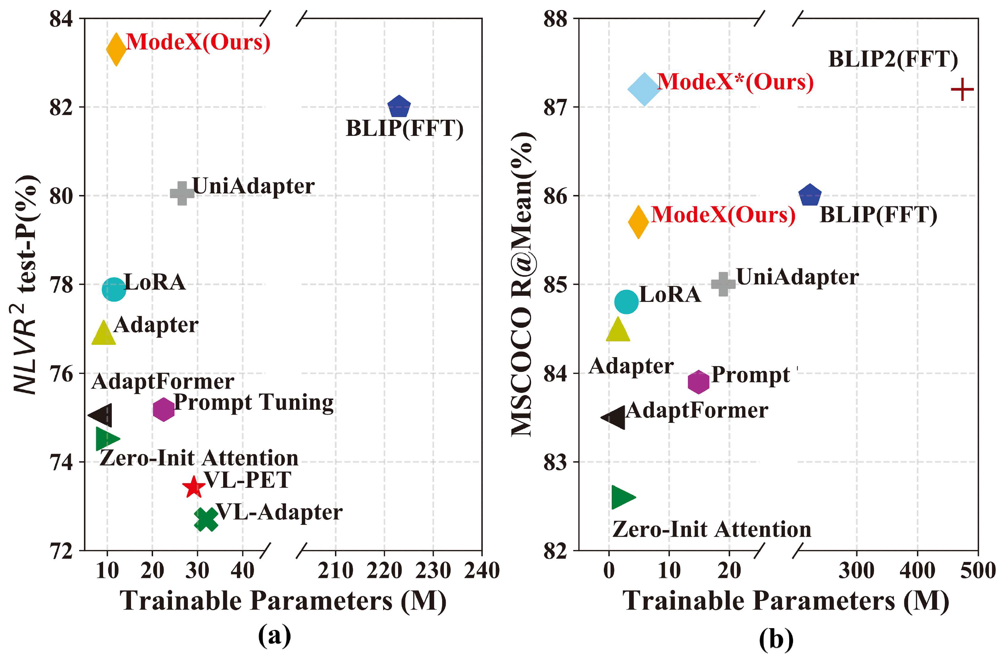

# ModeX

[SCIS2024] The official implementation of paper "Modality-experts coordinated adaptation for large multimodal models", by Yan Zhang, Zhong Ji, Yanwei Pang, Jungong Han, Xuelong Li. It is built on top of the [LAVIS](https://github.com/salesforce/LAVIS) in PyTorch. The paper link is [there](https://www.sciengine.com/SCIS/doi/10.1007/s11432-024-4234-4;JSESSIONID=2a369ea6-78b4-409b-b379-1f28a63ddd9c).



## Getting Started
Follow the [Instructions](https://github.com/salesforce/LAVIS/blob/main/README.md#installation) to create environment.

## Dataset
The common vision-language datasets could be downloaded by [automatic download tools](https://opensource.salesforce.com/LAVIS//latest/benchmark), which could be employed to organize these datasets.

Then, modify the corresponding path in [configs](lavis/configs) and the [default.yaml](lavis/configs/default.yaml).

## Training 

Runing the scripts in [run_scripts](run_scripts) for training and evaluation.

For more details and advanced usages, please refer to [documentation](https://opensource.salesforce.com/LAVIS//latest/index.html#).

## Please use the following bib entry to cite this paper if you are using any resources from the repo.
```
@article{:/publisher/Science China Press/journal/SCIENCE CHINA Information Sciences/67/12/10.1007/s11432-024-4234-4,
  author = "Yan ZHANG,Zhong JI,Yanwei PANG,Jungong HAN,Xuelong LI",
  title = "Modality-experts coordinated adaptation for large multimodal models",
  journal = "SCIENCE CHINA Information Sciences",
  year = "2024",
  volume = "67",
  number = "12",
  pages = "220107-",
  url = "http://www.sciengine.com/publisher/Science China Press/journal/SCIENCE CHINA Information Sciences/67/12/10.1007/s11432-024-4234-4,
  doi = "https://doi.org/10.1007/s11432-024-4234-4"
}
```

## Acknowledgement
Our codebase is built based on the popular [LAVIS](https://github.com/salesforce/LAVIS) repository, which is under [BSD 3-Clause License](LICENSE.txt).
